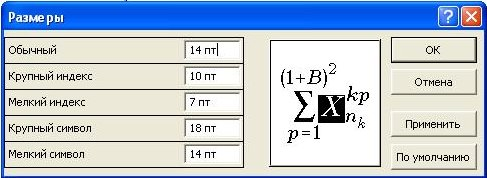

# введение

привет мир

<!-- {width=50%} -->

# теория

## ученье есть свет, а неученье есть тьма

Рассматриваемая проблема чрезвычайно важна, мы даже представить себе не можем насколько 

{width=50%}

<!-- {width=50%} -->

# люблю прогать!
## пример

Тире --- это длинная черточка, а дефис - короткая. В МИРЭА можно использовать только тире.

~~~ {.c caption="Hello world" other=nonono}
int main() {
	int a, b;
	scanf("%d%d", &a, &b);
	printf("%d", a+b);
	return 0;
}
~~~

plfegq

-------     ------ ----------   -------
     12     12        12             12
    123     123       123           123
      1     1          1              1
-------     ------ ----------   -------
Table: Here's the caption. It, too, may span
multiple lines.

$$a=\sum_{k=1}x_k$$

* hello
* World
* everyone

1. yes
2. no
3. done
